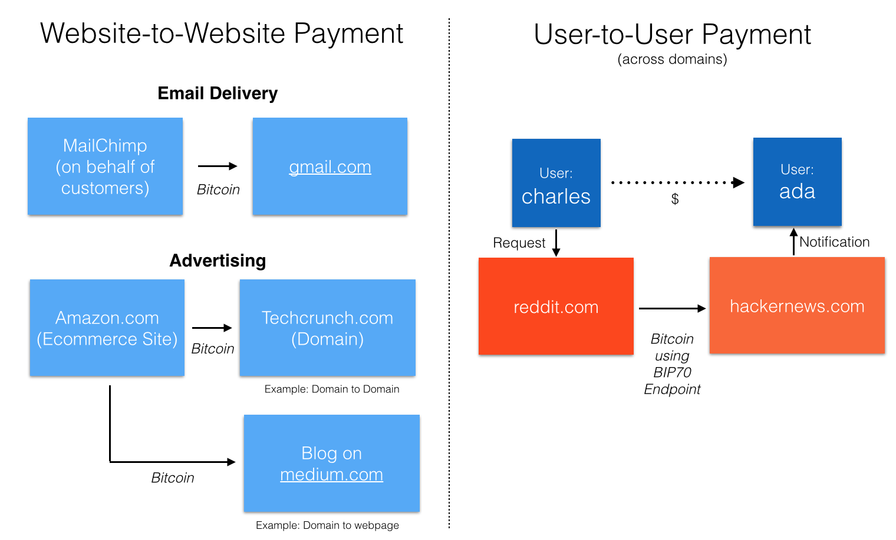

<h1 style="color:#428bca;">sitepay</h1>
*Please note: sitepay is currently in its* **Request for Comment (RFC)** *phase*

### Overview
sitepay is a way for any domain to publish where it will accept Bitcoin payments and receive messages related to those payments using DNS and HTTPS. Using sitepay, Bitcoin, and the Bitcoin Payment Protocol, any party can pay a domain securely and directly, with the ability to exchange payment metadata. It is made so sophisticated parties (e.g., other domains) can easily resolve payment locations in a standardized manner. 

sitepay works by defining a standard endpoint (by default, */epayment/bitcoin* at the *www* subdomain) where domains provide a BIP 70 handler to receive payments. sitepay also defines a way to make custom endpoints on that domain or on an external domain using one or more DNS TXT records.

### Why sitepay?
Using sitepay and Bitcoin, domains can route or collect payments, similar to how a publicized [SWIFT](http://en.wikipedia.org/wiki/Society_for_Worldwide_Interbank_Financial_Telecommunication#Standards) address allows a bank to accept payments and related messages for itself or on behalf of others ([simplified SWIFT diagram](https://i-msdn.sec.s-msft.com/dynimg/IC113877.gif)). This is designed to be used by sophisticated parties (e.g., other domains, businesses) in an automated, standardized manner - not for end users to pay a domain for a purchase.

*Example*  
In the simplest case, a domain owner can accept money for itself.  For instance, a commonly discussed use case for micropayments is for an email provider to ask for an optional, small payment to reduce the likelihood that a message is spam (in fact, this use case led to the genesis of [HashCash](http://www.hashcash.org/) a crucial antecedent to Bitcoin).  With sitepay, the email service provider can publicize where such payments will be collected. Any other party (referred to here as the “sender” or “payer”) can then easily send a Bitcoin payment by following the publicized instructions. Without sitepay, this can be done by individually negotiating with each counteparty, which does not scale when a party needs to interact with many, potentially changing counterparties.

Over time, a domain (like a social network) could accept Bitcoin payments on behalf of its users by either providing username associated public keys or holding funds on their behalf. To enable this transaction, a paying party could pay the domain in Bitcoin and then let the domain know where the payment should be routed (e.g., a username). (Due to money transfer laws in certain countries, this use case may be limited in success initially)

**Figure: Examples**

##### Benefits for transacting parties
sitepay lets a domain accept payments directly for itself or for its users. Currently, many payments are routed through financial institutions or other third parties who have:  

1. **high fees** (both payment transaction fees and other fees related to their central positioning as middlemen)  
2. **fixed costs** that make microtransactions impossible  

sitepay makes it easier for the parties to find each other's payment information and then send, receive, and communicate about transactions directly, often at lower cost.  

##### Benefits for Bitcoin
By publishing a specification, we hope that sitepay will lead to increased usage of Bitcoin online, as a domain can provide a seamless experience for other parties that it interacts with - *without requiring broad consumer uptake of Bitcoin from the start*. sitepay initially leverages Bitcoin as a medium of exchange and does not necessarily require it to be a highly stable store of value or unit of account, thus increasing the likelihood of early adoption. Beyond general benefits, this proposal likely reduces the number of Bitcoin transactions due to the potential to pool payments.

Over time, we expect new types of participants beyond domains to similarly publish their payment information and transact with counterparties directly rather than through existing third parties. This could bolster the uptake of Bitcoin and open up new use cases for direct payments online through cryptocurrencies.  

### Key Components
sitepay is a proposal on top of [Bitcoin](https://bitcoin.org/en/) (a payment system) and [Bitcoin Improvement Proposal 70](https://github.com/bitcoin/bips/blob/master/bip-0070.mediawiki) (referred to as BIP 70 or the Bitcoin Payment Protocol), a handshake and transfer process to allow the secure acceptance of Bitcoin. sitepay simply adds the ability of a domain owner owner to identify this endpoint so that external parties (payers) can discover it.

### Design Considerations
sitepay was designed with the following philosophies:  
- **Secure**: Payments should be secure with no risk of spoofing
- **Universally accessible**: It should be easy to determine a party's payment location leveraging existing and commonly used infrastructure (e.g., DNS, SSL/TLS, BIPs)
- **Extensible**: Individual parties or groups of parties should be able to build on data structures for their own needs or use cases
- **Easy to deploy**: Domain administrators should find sitepay easy to deploy, with the potential to use trusted, third-party providers that make this even easier

### Getting Started
We provide instructions for:

- **Domain owners** to implement sitepay on their domains
- **Payers** to determine what the valid payment endpoint is for a given domain
- **Wallet providers** to allow easy implementation of sitepay

#### For Domain Owners
##### Simple
*Receive payments on your domain*

Domain owners can receive payments by implementing [BIP 70](https://github.com/bitcoin/bips/blob/master/bip-0070.mediawiki) at the *www* subdomain of the */epayment/bitcoin* endpoint, secured by HTTPS/TLS 1.2 or better. This endpoint should only return PaymentRequests with the amount for each output set to 0 (this allows a payer to specify the payment amount).

*Receive payments on a separate domain*

Alternatively, the BIP 70 endpoint can be managed on a separate domain (allowing the use of a third-party provider), but this endpoint must be accessible over HTTPS/TLS 1.2 - and it must sign all PaymentRequests with the private key of the original domain's valid X.509 certificate. Once the endpoint has been setup, you must:

1. Provide your X.509 certificate private key to this **trusted** third-party provider
  - You must trust your third party to retain this key as a malicious third-party that has your private key can spoof your domain
  - The private key used to sign, must represent the subdomain where the payer would like to pay or be a wildcard certificate (we recommend the former, as it prevents a malicious third-party from impersonating your entire domain)

2. Create a TXT record indicating the path of the endpoint:

  | Host |                      TXT Value                     |  TTL  |
  |:----:|:--------------------------------------------------:|:-----:|
  | @    | sitepay_path=[\*]xyz.example.com/some/path | 1 Day |

  - Now payers who want to pay your domain, will assume you have a valid BIP 70 endpoint at https://xyz.example.com/some/path/bitcoin (with the trailing bitcoin now appended), where PaymentRequests will be signed with a wildcard X.509 certificate private key. These payers will verify that both the https certificate and the PaymentRequest signature are valid (e.g., not expired, not revoked).

##### Custom
As a domain name owner, publishing your payment information requires a few steps: 

1. Create a [BIP 70](https://github.com/bitcoin/bips/blob/master/bip-0070.mediawiki), sitepay-compliant endpoint
  - BIP 70 works by allowing a paying party to submit a GET request to receive payment information (a *PaymentRequest*), and then a POST to send the signed transaction (a *Payment*), and optionally a memo associated with the payment; the process ends, when the payee responds to the *Payment* provided in a separate HTTP POST with a *PaymentACK*
  - You can implement an endpoint to receive payments in two ways:
    1. *Implement yourself*: You can implement BIP 70 on your domain using the original spec or custom libraries (TODO)
    2. *Use a third-party provider*: This means the endpoint will live on a separate domain from the domain being paid, and the generated PaymentRequests *MUST* be signed by the third party using the private key x.509 certificate of the domain and subdomain it represents
  - The endpoint should only return a PaymentRequest with the amount for each output set to 0, so that the payer can specify a custom payment amount ('sitepay-compliant')
  - We recommend that payers send metadata in stringified JSON to the payee in the memo field of the *Payment* (e.g., a username could be provided where the payment should be routed to - see [examples](https://github.com/nemild/sitepay-message-data)). The payee can respond with their own stringified JSON in the memo field of the *PaymentACK*, such as a follow-up private token to reference that transaction. We will list standards for field names and structures for the most popular use cases in a [separate repository](https://github.com/nemild/sitepay-message-data). Please file an issue in the separate repo to propose your own data structures.

2. If the endpoint will be on your domain, allow access to <i>/epayment/bitcoin</i> it at the *www* subdomain or a custom endpoint of your choosing through **HTTPS** (using TLS 1.2 or better)
  - This endpoint will handle the GET part of the BIP 70 handshake
  - We use HTTPS (using TLS) to mitigate the risk of spoofing, and payers will consider an endpoint unsafe if it does not have a valid, trusted certificate or if it has a weak cipher
  - The custom endpoint MUST end in */bitcoin* (e.g., */some/custom/endpoint/bitcoin*), and by selecting a custom endpoint, third parties will not use the default endpoint

3. Create a TXT DNS entry (only if you chose a custom endpoint)
  - In the example below, the fields in brackets are the subdomains where this rule applies, and the field before the colon is the subdomain where the associated BIP 70 endpoint can be found. Semicolons can be used to denote multiple rules, and additional TXT fields can be added if the TXT record field size is not enough. As in the simple example, the */bitcoin* at the end of the endpoint is excluded and the endpoint must be reachable through HTTPS:

  | Host |                      TXT Value                     |  TTL  |
  |:----:|:--------------------------------------------------:|:-----:|
  | @    | sitepay_path=[mail,search]xyz.example.com/some/path | 1 Day |

  - Visually, the structure is as follows:

  | sitepay identifier | separator | subdomains selected | BIP 70 endpoint path |
  |:----:|:-------:|:-----:|:-----:|
  | sitepay_path | = | [subdomain1,subdomain2] | subdomain.example.com/RELATIVE/PATH |

  - a `*` can be used as a subdomain wildcard if you would like to select all subdomains on your site where the rule applies
  - As noted earlier, if this endpoint is not accessible on the domain it represents, the generated PaymentRequests *MUST* be signed using the private key of the domain it represents
  - the HTTPS is excluded in the BIP 70 endpoint URL, as this is required
  - The TTL (time to live) value can be set to a value based on how long third-parties should cache this value
  - To provide additional security, domain owners may consider [DNSSEC](https://www.icann.org/resources/pages/dnssec-qaa-2014-01-29-en), in addition to (but not in place of) HTTPS
  - To modify TXT settings, see [Google's instructions for popular DNS providers](https://support.google.com/a/topic/1409901) (Google uses TXT fields as one way to authenticate ownership of a domain)

4. We recommend that human-readable instructions for payment be included */epayment/instructions* at the relevant subdomain on the domain that is being paid

#### For Payers
Payers need to determine where a domain would like to be paid:

1. A payer should consult the TXT records for a domain to determine if a custom BIP 70 endpoint has been set
  - The TXT record applies to one or more subdomains on a given site
  - If the TXT field is missing, you can query the */epayment/bitcoin* at the *www* subdomain to see if it is active and supports BIP 70

2. Verify that the endpoint is valid
  - For an endpoint which is on a domain different from the domain you would like to pay:
    - You must confirm that the payment URL has a valid HTTPS certificate per X.509
    - You must also confirm that the generated PaymentRequest is signed using the original domain's X.509 certificate private key, reflecting the subdomain that you would like to pay to
  - For a BIP 70 endpoint on the domain, you must confirm that the payment URL has a valid HTTPS certificate per X.509

3. Verify that the endpoint implements BIP 70

In the future, we will provide a way to quickly and securely determine the endpoint where a domain should be paid using both a website and a library.

**Security Suggestions**

Payers should follow commonly accepted standards to [validate HTTPS certificates](http://tools.ietf.org/html/rfc5280) per X.509, which allows verification of an entity's identity. We highlight a few other best practices:
  - As suggested in BIP 70, we suggest your operating system's root certificate store or the [Mozilla root store](http://www.mozilla.org/projects/security/certs/included/index.html)
  - We recommend that payers require [OCSP stapling](http://en.wikipedia.org/wiki/OCSP_stapling) in case a certificate has been revoked (more details on [OCSP](http://tools.ietf.org/html/rfc2560)), and reject payments to parties that do not implement this

#### For Wallet Providers
This proposal can benefit wallet providers by opening up a new class of user and substantially increasing the total amount of Bitcoins transacted. Wallet providers play a key role in making this proposal easy to implement.

Once wallet providers implement [BIP 70](https://github.com/bitcoin/bips/blob/master/bip-0070.mediawiki), they need to make a few final modifications: 

1. The initial GET for a BIP 70 *PaymentRequest* should return a PaymentRequest with amount for all outputs set to 0; this allows the payer to specify the amount to be paid
2. For managed endpoints that live on the wallet providers domain, the wallet provider must setup a facility to securely hold the domain's x.509 certificate private key, and provide on-demand signing of PaymentRequests
3. When the BIP 70 *Payment* is submitted by the payer, the memo field must be forwarded onto the wallet owner (e.g., through a notification) and recorded  
4. The wallet owner can then respond with a custom memo to the wallet provider which is returned in the *PaymentACK* to the payer  

Over time, wallet providers can automate the management for particular use cases, reducing the need to check with the wallet owner in realtime as a payment is being made.

If you are a wallet provider, please [contact](mailto:nemild@gmail.com) with any questions - and if you have a series of use cases that you would like to standardize the messaging data structures for, please submit a proposal for the field names and structure of the *Payment* memo field and *PaymentACK* memo field to the [appropriate repository](https://github.com/nemild/sitepay-message-data).
  
### Notes
- Certain jurisdictions have money transfer laws to prevent [money laundering](http://en.wikipedia.org/wiki/Money_laundering#Enforcement) and [financial flows for illegal purposes](http://en.wikipedia.org/wiki/Know_your_customer); there also are definitions and requirements for money transfer agents ([US Regulations](http://www.fincen.gov/financial_institutions/msb/)). While sitepay is agnostic to use case, each implementer should consult the relevant laws in their area related to their planned use
- Whenever a party is acting on behalf of another in financial markets, an even higher degree of controls need to be in place to prevent any risk of funds disappearing (for most sites, an easy way to initially use sitepay is to accept payments for themeselves, not on behalf of other parties)

### Contributors
We welcome feedback and other contributions. To drop the author a note, send an email to nemild@gmail.com

Key Contributors (Github usernames):
- nemild
- 46bit

Reviewers (Github usernames):
- cdecker
- flavien
- kaykurokawa
- TheBlueMatt

### Licensing
sitepay is released under an [MIT license](http://opensource.org/licenses/MIT).
